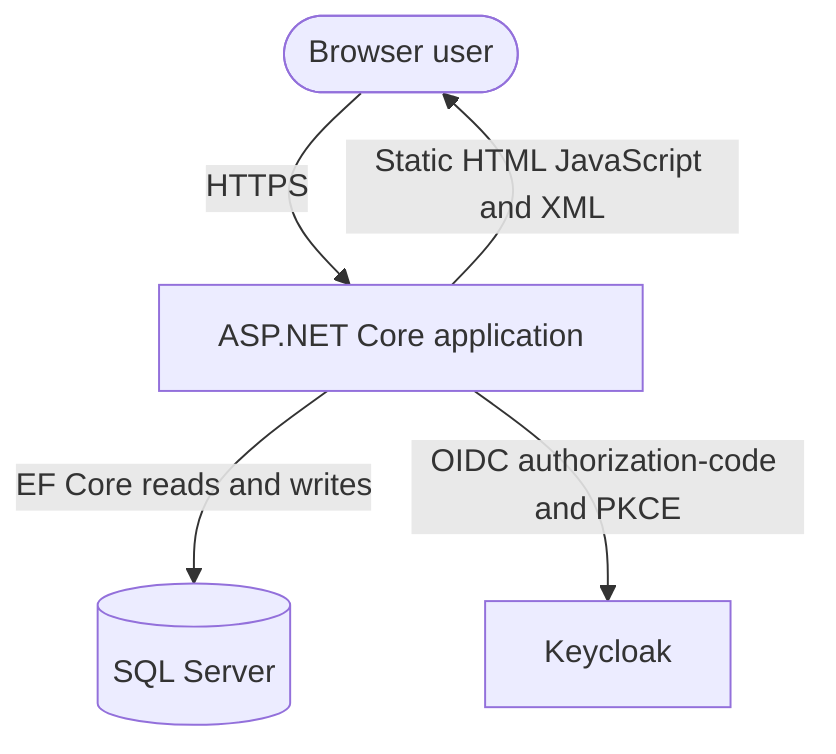
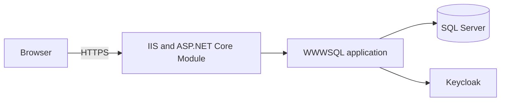

# Application Architecture & Technology Document: WWWSQL - WWW SQL Designer

This document records the evidence-based architecture of the single ASP.NET Core application and its browser test project.

## Revision History

| Version | Date | Author | Changes |
| :--- | :--- | :--- | :--- |
| `1.0` | `2026-09-15` | `Architecture Review Agent` | `Updated architecture and security-boundary review` |

## 1. Metadata & Organizational Alignment

| Metadata Field | Value / Description |
| :--- | :--- |
| **Application Acronym** | WWWSQL |
| **Full Application Name** | WWW SQL Designer |
| **Status** | Active |
| **Ministry** | Unknown from repository evidence |
| **Division** | Unknown from repository evidence |

The repository is a single deployable application with a separate non-packable test project. Organizational ownership is not evidenced in source.

## 2. System Overview & Boundaries

### 2.1 Capability Statement

WWW SQL Designer provides a browser-based visual database-modeling workspace. Users create, import, export, save, load, and share SQL schema models through an ASP.NET Core MVC application backed by SQL Server and optionally protected by Keycloak OIDC.

### 2.2 System Context Diagram



### 2.3 Platform role, reuse, and data responsibility

| Assessment | Result | Evidence / Owner | Confidence |
| :--- | :--- | :--- | :--- |
| **Conditional role** | Point solution | One application project and one test project; no shared-service catalogue found | Verified |
| **One-to-many impact** | Unknown | No consumer inventory or service catalogue in repository | Unknown |
| **Reuse or build decision** | Reuse of ASP.NET Core, EF Core, SQL Server, and Keycloak capabilities is evidenced; accountable platform owner is unknown | Project files and Program.cs | Verified |
| **Data custodian and permitted purpose/subject scope** | Unknown | Data models contain user-created schema content; custodian policy is not in repository | Unknown |
| **Data sharing spectrum** | Shared within owner/group/grant authorization | Controller owner and grant predicates | Verified |
| **Narrow question API vs. broad data access** | Broad model XML is returned for authorized model loads; no OpenAPI contract is present | WwwSqlController routes | Verified |

## 3. Logical & Structural Component Breakdown

```text
WwwSqlDesigner.sln
|- WwwSqlDesigner/                 ASP.NET Core web application
|  |- Controllers/                 MVC and account/API boundaries
|  |- Data/                        EF Core context and model entities
|  |- Authentication/              Keycloak settings and filters
|  |- ServerExports/               Embedded server-side provider templates
|  |- wwwroot/                     Browser UI and portable XML model IO
|  `- Program.cs                   Composition root and middleware
`- WwwSqlDesigner.Tests/           MSTest, integration, and Playwright tests
```

### 3.1 Key Architecture Seams

* **Web composition and middleware:** `Program.cs` configures EF Core, authentication, antiforgery, rate limiting, static files, routing, and authorization.
* **Resource/API boundary:** `Controllers/WwwSqlController.cs` applies owner, group, and grant filters before model access.
* **Persistence boundary:** `Data/ApplicationDbContext.cs` maps model versions and access grants to SQL Server.
* **Browser model boundary:** `wwwroot/js/io.js`, `row.js`, and `portabletypes.js` edit and serialize the portable model, then request exports from the server.
* **Export boundary:** `Services/ServerSchemaServices.cs` reads canonical JSON or portable XML, preserves structural and governance metadata, maps portable types, and invokes embedded server-side templates for every supported target.

### 3.2 Entry Points & Gateways

| Entry Point | Type | Path / Reference |
| :--- | :--- | :--- |
| AccountController | MVC/API | `/account/login`, `/account/status`, `/account/logout` |
| WwwSqlController | REST-like MVC API | `/backend/netcore-ef/list`, `load`, `save`, `csrf`, `access`, and grant routes |
| Static browser application | Static web assets | `/`, `/index.html`, `/js/*`, `/css/*` |
| OIDC callbacks | Identity callback | `/signin-oidc` and `/signout-callback-oidc` |

## 4. API Surface & Contracts

### 4.1 API Versioning Strategy

| API Version | Status | Base Path / Header | Sunset Date |
| :--- | :--- | :--- | :--- |
| Unversioned | Active | `/backend/netcore-ef` | Not defined |

### 4.2 Contract Documentation

| Contract Type | Location | Auto-Generated |
| :--- | :--- | :--- |
| MVC route and XML/JSON responses | Controller source and browser tests | No |

### 4.3 Contract Testing

Controller and browser tests exercise authorization, XML round trips, exports, and response behavior. No consumer-driven contract suite is present.

### 4.4 Contract ownership and dependency behavior

| Contract / Dependency | Owner | Version / compatibility policy | Timeout, cancellation, retry and idempotency | Fallback, stale-data and rollback behavior |
| :--- | :--- | :--- | :--- | :--- |
| Keycloak OIDC | Unknown external owner | OIDC authorization-code flow with PKCE; package line follows .NET 10 | Callback failure redirects to authentication-error; no repository timeout policy | Authentication failure does not grant resource access |
| SQL Server via EF Core | Application/platform owner unknown | EF Core 10 and SQL Server provider | Request cancellation is available on body reads; database retry policy is not configured | Database failure is surfaced through normal exception handling |
| Browser XML model contract | Application owner unknown | Portable-v1 plus dialect adapters | Client parser rejects DTD/ENTITY and invalid XML; server requires strict UTF-8, validates XML, and caps saved bodies at 1 MiB | Invalid, malformed, non-UTF-8, or oversized model is rejected with 400 |

## 5. Unicode, UTF-8 & Indigenous-Language Readiness

| Boundary | Encoding / Unicode Type | Collation / Comparison | Round-Trip Evidence | Status |
| :--- | :--- | :--- | :--- | :--- |
| UI and HTTP input/output | UTF-8 request reader and XML responses | Browser and .NET string semantics | XML and locale browser tests | Verified |
| Application processing and validation | .NET `string`; XML reader validation | Exact identity keys use explicit byte-length/index rules | Controller and authorization tests | Verified |
| Database, indexes, and search | SQL Server string columns and configured collation | Identity comparisons use exact key expressions | EF model configuration and schema tests | Verified for identifiers; linguistic policy unknown |
| Messages, caches, and integrations | No message bus or cache evidenced | N/A | No integration evidence | Unknown |
| Files, imports, exports, reports, and printing | UTF-8 XML, server-rendered exports, metadata sidecars, and browser downloads | Provider-specific features are verified against the legacy template contract | XML round-trip and exporter parity tests | Verified |
| Runtime globalization data and fonts | Browser/runtime defaults | No language-specific policy found | No representative Indigenous-language corpus | Gap |

- **Normalization policy:** Not documented.
- **Identifier vs. linguistic comparison policy:** Exact identity comparison is configured; linguistic comparison policy is unknown.
- **Grapheme-aware operations:** Not evidenced.
- **Known incompatible downstream systems and migration plan:** None identified; no plan recorded.
- **Representative Indigenous-language test corpus:** Not present.

## 6. Security Architecture

### 6.1 Authentication & Authorization Model

| Aspect | Implementation |
| :--- | :--- |
| **Authentication Method** | Keycloak OIDC authorization-code flow with PKCE and cookie session |
| **Identity Provider** | Keycloak |
| **Authorization Model** | Owner, group, global-model, and explicit grant checks |
| **Token Format** | OIDC tokens held by server-side authentication middleware |
| **Token Storage** | HttpOnly secure cookie configuration through ASP.NET Core |

State-changing routes use antiforgery validation. Model writes are explicitly capped at 1 MiB, require strict UTF-8 decoding, and are rate-limited per authenticated identity or client address after routing and authentication select the endpoint policy. Client-side type hints use `textContent`, and portable facets reject XML markup characters before exporter-specific semantic validation.

### 6.2 Cryptographic Controls

OIDC and cookie cryptography are delegated to ASP.NET Core and the identity provider. No custom cryptography or tracked production private key was found. Production OIDC metadata requires HTTPS.

### 6.3 Concurrency & Data Integrity

EF Core persistence and database uniqueness constraints protect model versions and access grants. Controller authorization filters are applied before resource retrieval. A database transaction/retry policy is not evidenced and should be addressed with deployment-specific requirements if concurrent write throughput increases.

### 6.4 Data Classification

| Data Category | Classification | Encryption at Rest | Encryption in Transit | Retention Policy |
| :--- | :--- | :--- | :--- | :--- |
| Saved SQL model XML | Unknown; user-provided schema content | SQL Server/deployment policy not evidenced | HTTPS in production | Application policy not documented |
| Identity and access metadata | Restricted operational data | SQL Server/deployment policy not evidenced | HTTPS and OIDC TLS | Identity-provider and application policy not documented |
| Browser static assets | Public | N/A | HTTPS in production | Release retention policy not documented |

## 7. Deployment & Infrastructure

| Environment | Purpose | Hosting | URL / Endpoint |
| :--- | :--- | :--- | :--- |
| Development | Local development and migrations | ASP.NET Core development host | Not fixed |
| Production | IIS ASP.NET Core hosting | In-process ASP.NET Core Module | Deployment URL not in repository |

### 7.1 Infrastructure Inventory

No container, Kubernetes, Terraform, or committed CI/CD manifest was found. `web.config` now defaults to Production, disables stdout logging, and sends browser security headers. Runtime secrets are expected from protected deployment configuration.



### 7.2 Pipeline and release controls

| Pipeline Aspect | Details |
| :--- | :--- |
| Build | Solution build and tests are available; pipeline file is not committed |
| Dependency restore | NuGet and npm lock/integrity files are used where present |
| Artifact integrity | Signing and SBOM publication are not evidenced |
| Deployment configuration | IIS web.config uses Production and disables stdout logs by default |

## 8. Observability

| Aspect | Details |
| :--- | :--- |
| Logging | Framework `ILogger` is used; structured security-audit schema is not documented |
| Metrics | No application metrics endpoint found |
| Tracing | No distributed tracing configuration found |
| Health | No explicit health/readiness endpoints found |
| Alerting | No alert rules or thresholds are committed |

| Endpoint / Check | Purpose | Alert Threshold |
| :--- | :--- | :--- |
| `/account/status` | Browser authentication status and CSRF bootstrap | Availability and unexpected error rate are not configured |
| Application logs | Runtime diagnostics and authorization-related warnings | No centralized threshold is evidenced |

## 9. Resilience & Disaster Recovery

| Aspect | Details |
| :--- | :--- |
| Availability | ASP.NET Core and SQL Server are required runtime dependencies |
| Recovery | Backup, restore, RTO, and RPO are not documented |
| Dependency degradation | OIDC or database failure does not intentionally expand authorization; detailed failover behavior is unknown |
| Data integrity | Database uniqueness constraints and EF persistence provide local integrity controls |
| Capacity | Model write body limit and per-client write rate limit provide application-level resource bounds |

## 10. Architecture Decision Records (ADRs)

| ADR ID | Title / Theme | Status | Date | Reference |
| :--- | :--- | :--- | :--- | :--- |
| ADR-001 | OIDC with Keycloak and PKCE | Accepted by implementation evidence | 2026-09-15 | `Program.cs` |
| ADR-002 | Portable-v1 model type representation | Accepted by implementation evidence | 2026-09-15 | `wwwroot/js/portabletypes.js` |
| ADR-003 | .NET 10 runtime and dependency line | Accepted for remediation branch | 2026-09-15 | Project files |

No separate ADR store is committed.

## 11. Architecture Review Agent Verification & Compliance Checklist

| Check | Result | Evidence |
| :--- | :--- | :--- |
| Repository classification | Pass | Single web application plus non-packable tests |
| Architecture output location | Pass | `docs/architecture.md` |
| Security boundaries documented | Pass | Authentication, authorization, antiforgery, rate limit, and XML boundary sections |
| Unicode/UTF-8 pass completed | Gap recorded | Section 5 records missing Indigenous-language corpus and normalization policy |
| Platform alignment evidence | Unknown recorded | No shared catalogue or accountable owner in repository |
| Zero Trust evidence | Partial | Resource checks and fail-closed authentication documented; revocation and telemetry remain unknown |
| Deployment evidence | Gap recorded | No committed pipeline, infrastructure, health, or recovery evidence |

- [x] **Technical Currency:** .NET 10 and current declared dependency lines are recorded. `[Confidence: Verified]`
- [ ] **Unicode End-to-End:** UTF-8 paths are present, but representative Indigenous-language round trips are not evidenced. `[Confidence: Unknown]`
- [ ] **Globalization Runtime:** Runtime globalization data and font coverage are not documented. `[Confidence: Unknown]`
- [x] **No Hardcoded Credentials:** No tracked production credential or private key was found. `[Confidence: Verified]`
- [x] **Cryptographic Controls:** OIDC, HTTPS metadata, and platform cookie cryptography are used; no custom weak cryptography was found. `[Confidence: Verified]`
- [ ] **Side-Channel Defenses:** No application-specific timing-sensitive credential comparison was identified, but a dedicated test is not present. `[Confidence: Unknown]`
- [ ] **Audit Logging:** Framework logging exists, but a structured security-audit schema is not evidenced. `[Confidence: Unknown]`
- [x] **Concurrency Safety:** Database uniqueness constraints protect model versions and access grants. `[Confidence: Verified]`
- [ ] **Dependency Health:** Dependency manifests are upgraded, but external advisory and SBOM publication controls are not committed. `[Confidence: Inferred]`
- [ ] **Observability:** No metrics, tracing, health endpoint, or alert configuration is committed. `[Confidence: Unknown]`
- [ ] **Deployment Pipeline:** No committed CI/CD pipeline or security gate is present. `[Confidence: Unknown]`
- [ ] **Data Classification:** Data categories are listed, but classification, encryption, and retention policy ownership are not evidenced. `[Confidence: Unknown]`
- [ ] **Disaster Recovery:** Backup, restore, RTO, and RPO evidence is not present. `[Confidence: Unknown]`
- [x] **Platform Role (conditional):** The repository is evidenced as a point solution. `[Confidence: Verified]`
- [ ] **Platform Data Responsibility (conditional):** Custodian and permitted-purpose evidence is not present. `[Confidence: Unknown]`
- [ ] **Contract Ownership (conditional):** External owner and compatibility-policy evidence is not present. `[Confidence: Unknown]`
- [ ] **Dependency Degradation (conditional):** Authentication failure does not grant access, but timeout and retry policy are not documented. `[Confidence: Unknown]`
- [x] **Protected Resources and Access Paths (conditional):** Model XML, versions, grants, account, and OIDC paths are inventoried. `[Confidence: Verified]`
- [x] **Resource Authorization (conditional):** Controller filtering enforces owner, group, global, and explicit grant access separately from sign-in. `[Confidence: Verified]`
- [ ] **Least Privilege and Lifetime (conditional):** Token lifetime, revocation, and workload scope policy are not documented. `[Confidence: Unknown]`
- [ ] **Revocation and Exceptions (conditional):** Revocation and time-bound exception evidence is not present. `[Confidence: Unknown]`
- [ ] **Safe Degradation and Evidence (conditional):** Authentication failure fails closed, but decision telemetry and dependency degradation evidence are incomplete. `[Confidence: Inferred]`
